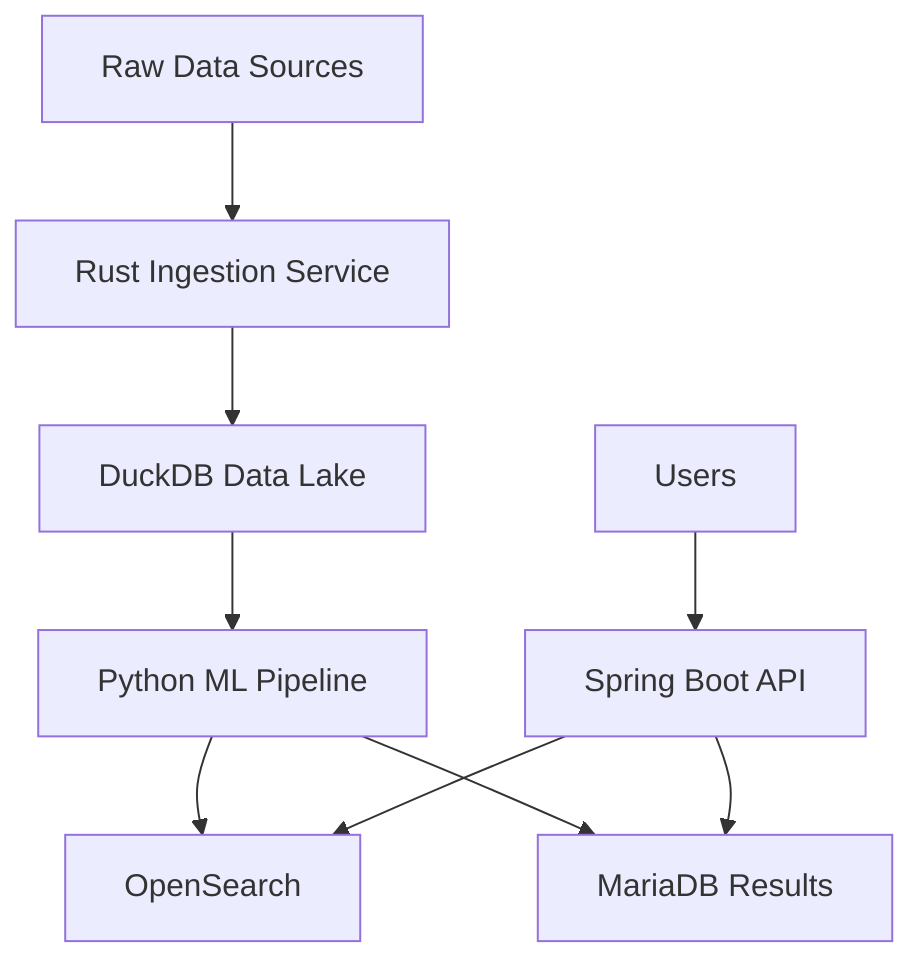

# Modern Development Setup Guide

## Your Stack-Specific Dev Environment

This guide shows how to use your enhanced containerized development environment for Rust data lakehouse, Python ML/OCR, and Java Spring Boot development.

## 🚀 Quick Start

```bash
# 1. Start all services
docker-compose up -d

# 2. Enter development container
docker exec -it setup_tool-dev-1 /bin/bash

# 3. Activate ML environment (inside container)
ml  # Alias for ML/AI Python environment

# 4. Check all services
docker-compose ps
```

## 📦 What's Included

### Core Services

- **Development Container**: Multi-language environment (Rust, Python, Java)
- **MariaDB**: Transactional database
- **PostgreSQL**: General-purpose database + DuckDB metadata
- **OpenSearch**: Search and analytics engine
- **OpenSearch Dashboards**: Visualization UI (http://localhost:5601)

### Language Stacks

#### 🦀 Rust (Data Lakehouse)

- Rust 1.75 with cargo, clippy, rustfmt
- sqlx-cli for database migrations
- polars-cli for data processing
- Performance profiling tools

#### 🐍 Python (ML/OCR/RAG)

- Python 3.11 with dedicated ML virtual environment
- PyTorch, TensorFlow, Transformers
- OCR: Tesseract, OpenCV, pdf2image
- LLM/RAG: LangChain, ChromaDB, OpenAI
- Data: DuckDB, Polars, PyArrow

#### ☕ Java (Spring Boot)

- Multiple Java versions (17, 21) via SDKMAN
- Spring Boot 2.7.18 and 3.3.0
- Maven and Gradle
- Full IDE support

## 🛠️ Development Workflows

### Python ML/OCR Development

```bash
# Enter container
docker exec -it setup_tool-dev-1 /bin/bash

# Activate ML environment
ml

# Start Jupyter for experimentation
jupyter  # Access at http://localhost:8888

# Run OCR example
python -c "
import pytesseract
from PIL import Image
# Your OCR code here
"

# Connect to databases
python -c "
import duckdb
import opensearch
# Your data pipeline here
"
```

### Rust Data Lakehouse

```bash
# Create new Rust project
cargo new --bin data-lakehouse
cd data-lakehouse

# Add dependencies
cargo add tokio duckdb polars serde

# Run with hot reload
cargo watch -x run

# Database migrations
sqlx migrate add create_tables
sqlx migrate run
```

### Java Spring Boot

```bash
# Switch Java versions
j17  # Use Java 17
j21  # Use Java 21

# Switch Spring Boot versions
sb27  # Spring Boot 2.7
sb33  # Spring Boot 3.3

# Create new project
spring init --dependencies=web,data-jpa,actuator myapp

# Run application
./gradlew bootRun
# or
./mvnw spring-boot:run
```

## 🗄️ Database Access

### Quick Connections

```bash
# MariaDB
mariadb-dev  # Alias connects you directly

# PostgreSQL
psql-dev     # Alias connects you directly

# DuckDB
duckdb-dev   # Opens warehouse database

# OpenSearch
opensearch-health  # Check cluster status
```

### From Your Code

```python
# Python connections
import pymysql
import psycopg2
import duckdb
from opensearch import OpenSearch

# Connection strings are in environment
mariadb_url = os.getenv("MARIADB_URL")
postgres_url = os.getenv("DATABASE_URL")
opensearch_url = os.getenv("OPENSEARCH_URL")
duckdb_path = os.getenv("DUCKDB_PATH")
```

```java
// Spring Boot application.yml
spring:
  datasource:
    url: ${MARIADB_URL:jdbc:mysql://mariadb:3306/dev}
    username: dev
    password: devpass
```

```rust
// Rust database connections
use sqlx::mysql::MySqlPool;
use sqlx::postgres::PgPool;

let mariadb = MySqlPool::connect(&env::var("MARIADB_URL")?).await?;
let postgres = PgPool::connect(&env::var("DATABASE_URL")?).await?;
```

## 🔧 Configuration

### VS Code Integration

Your `.devcontainer/devcontainer.json` is already configured with:

- Language-specific extensions
- Debugger configurations
- Port forwarding
- Format-on-save

### Environment Variables

All services have pre-configured connection strings:

- `DATABASE_URL`: PostgreSQL connection
- `MARIADB_URL`: MariaDB connection
- `OPENSEARCH_URL`: OpenSearch endpoint
- `DUCKDB_PATH`: DuckDB file location

## 📊 Data Lakehouse Architecture



### Best Practices

1. **Rust Service**: High-performance data ingestion

   - Use for ETL/ELT pipelines
   - Stream processing with Tokio
   - Direct DuckDB writes

2. **Python ML**: Analysis and AI

   - Jupyter for exploration
   - Production scripts in `/workspace/ml`
   - Model versioning with MLflow

3. **Java API**: Business logic and APIs
   - RESTful services with Spring Boot
   - Database transactions with JPA
   - Integration with legacy BBx system

## 🚢 Production Path

When ready to deploy:

```bash
# Use the production Dockerfile
docker build -f .devcontainer/Dockerfile.production \
  --target python-service \
  -t myapp/ml-service:latest .

docker build -f .devcontainer/Dockerfile.production \
  --target rust-service \
  -t myapp/data-service:latest .

docker build -f .devcontainer/Dockerfile.production \
  --target java-service \
  -t myapp/api-service:latest .
```

### Production Considerations

1. **Security**:

   - Non-root users in all containers
   - Minimal base images
   - No development tools in production

2. **Performance**:

   - Multi-stage builds for smaller images
   - JVM container optimizations
   - Compiled Python dependencies

3. **Monitoring**:
   - Health checks on all services
   - OpenSearch for logs/metrics
   - Prometheus-compatible endpoints

## 🔍 Troubleshooting

### Container Issues

```bash
# View all logs
docker-compose logs -f

# Restart specific service
docker-compose restart opensearch

# Rebuild after Dockerfile changes
docker-compose build --no-cache dev
```

### Performance Tuning

```bash
# Allocate more memory to OpenSearch
# Edit docker-compose.yml:
environment:
  - "OPENSEARCH_JAVA_OPTS=-Xms1g -Xmx1g"

# Monitor resource usage
docker stats
```

### Database Connections

```bash
# Test connections from host
docker exec -it setup_tool-mariadb-1 mariadb -u root -prootpass
docker exec -it setup_tool-postgres-1 psql -U postgres

# Reset databases
docker-compose down -v  # Warning: Deletes all data
docker-compose up -d
```

## 📚 Next Steps

1. **Customize for Your Project**:

   - Add project-specific dependencies
   - Configure database schemas
   - Set up CI/CD pipelines

2. **Team Onboarding**:

   - Share this setup with your team
   - Document project-specific workflows
   - Create sample data for testing

3. **Production Planning**:
   - Review security settings
   - Plan deployment strategy
   - Set up monitoring/alerting

## 🤝 Best Practices Summary

✅ **DO**:

- Use the ML virtual environment for Python AI/ML work
- Leverage database aliases for quick access
- Run long processes in tmux sessions
- Use Docker volumes for persistent data
- Commit your `.devcontainer` changes

❌ **DON'T**:

- Install system packages without updating Dockerfile
- Use root user for development
- Expose databases to public internet
- Ignore container health checks
- Mix development and production configs

---

**Remember**: This setup eliminates "it works on my machine" forever. Every developer gets the exact same environment, and it's ready to transition to production when you are!
